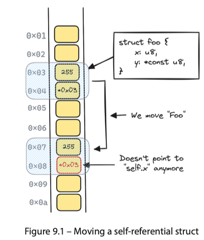
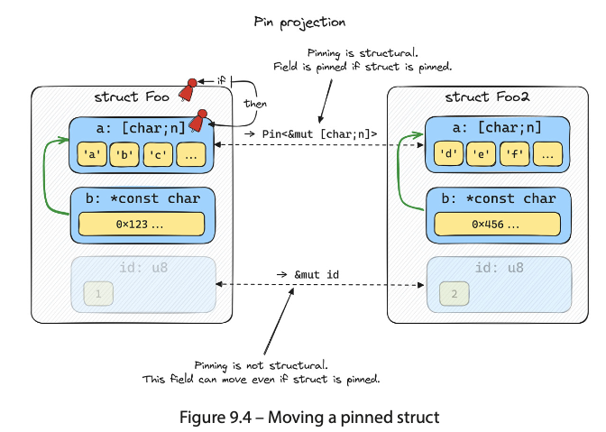

# Coroutines, self-referential structures, and pinning

> При выполнение `move` для `self-referential` структуры, происходить глубокая копия структуры. Одно из полей структуры, которое ранее указывало на  
другое поле, при перемещении сохраняет своё значение (адрес не изменяется).**Однако, адрес другого поля, на которое оно указывает, изменился.** В результате имеем  
инвалидированный указатель.  

.  

## Pinning

Пиннинг позволяет зафиксировать адрес данных, запрещая любые операции, которые могли бы их переместить (`move`)  

. 

Пиннинг состоит из двух частей: тип `Pin` и маркер-трейт `Unpin`.  

1. <Pin\<T\>> оборачивает тип, реализующий трейт `Deref` (`ссылки` и `умные указатели`)
2. `Unpin` трейт, который означает, что пиннинг не применим к типу `T`, который им помечен

> Почти все типы реализуют трейт `Unpin`. Для того, чтобы пиннинг работал, требуется реализовать для`T` трейт `!Unpin`.  
Тип, который помечен как `!Unpin`, гарантирует что значение будет находиться по тому же адресу, что и в момент создания, до того момента,  
пока оно не будет дропнуто.

Для pinned типов существуют методы-хэлперы - `pin projections`:

1. Не структурные ```fn a(self: Pin<&mut self>) -> &A```
2. Структурные ```fn b(self: Pin<&mut self>) -> Pin<&mut T>)```.  

### Привязка(pinning) к куче

```rust
use std::{marker::PhantomPinned, pin::Pin};

#[derive(Default)]
struct MaybeSelfRef {
    a: usize,
    b: Option<*const usize>,
    _pin: PhantomPinned,
}

impl MaybeSelfRef {
    fn init(self: Pin<&mut Self>) {
        unsafe {
            let Self{a, b, ..} = self.get_unchecked_mut();
            *b = Some(a);
        }
    }

    fn b(self: Pin<&mut Self>) -> Option<&mut usize> {
        unsafe {
            self.get_unchecked_mut().b.map(\|b| &mut *b)
        }
    }
}

fn main() {
    let mut x = Box::pin(MaybeSelfRef::default());
    x.as_mut().init();
    println!("{}", x.as_ref().a);
    *x.as_mut().b().unwrap() = 42;
    println!("{}", x.as_ref().a);
}

```